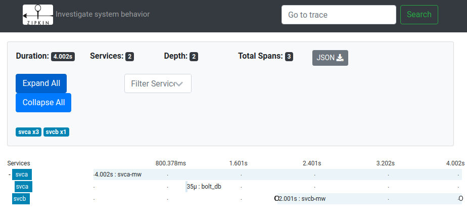

# zipkin-go example

An example of zipkin-go based on code in go blog series http://callistaenterprise.se/blogg/teknik/2017/02/17/go-blog-series-part12/. In the above series, opentracing zipkin go library was used. This example uses [zipkin-go](https://zipkin.io/pages/existing_instrumentations.html) which supports V2 API instead.

## What it looks like in zipkin UI

service A queries bolt db, then issue a rest call to service B. Between each operation, there is some sleep time to make the graph look more clearly.


## Build and deploy

It requires docker, docker-compose installed. From the same folder with Makefile, run

```sh
# Triggers multi-stage build for 2 images.
make image
# Spin up service a, b and zipkin.
docker-compose up -d
# Try access services a. Takes a while because of the sleep added in between.
curl localhost:18080/accouns/10003
{"id":"10003","name":"Person_3","servedBy":"172.19.0.4","quote":{"quote":"May the source be with account ID 10003","ipAddress":"svcb","language":"en"}}
# Open browser at localhost:19411 then it shows the above picture. 
# Tear down.
docker-compose down -v
```

## The key to the library

The interception starts from the endpoint, by putting in more header with the request context. This context need to be passed down to make things work.
eg. for boltdb

```go
tracer := common.GetTracer()
var parentContext zipkinmodel.SpanContext
if span := zipkin.SpanFromContext(ctx); span != nil {
    parentContext = span.Context()
}
appSpan := tracer.StartSpan("bolt_db", zipkin.Parent(parentContext))
defer appSpan.Finish()
```

eg. for outgoing http request

```go
addr := fmt.Sprintf("http://svcb:8080/quotes/%s", accountID)
req, _ := http.NewRequest("GET", addr, nil)
// Put request context for service a to the new request to service b
req = req.WithContext(ctx)

client, err := zipkinhttp.NewClient(common.GetTracer(),
    zipkinhttp.ClientTrace(true))
if err != nil {
    log.Fatalf("unable to create client: %+v\n", err)
}
resp, err := client.DoWithAppSpan(req, req.URL.String())
```

eg. for middleware

```go
router.Use(zipkinhttp.NewServerMiddleware(
    common.GetTracer(),
    zipkinhttp.SpanName("svca-mw")), // name for request span
)
```
